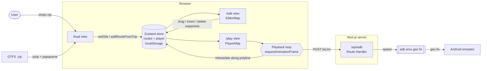

# adb-gps-playback

Stream simulated GPS fixes to a running Android emulator along a GTFS route.
Load a GTFS feed in-browser, pick trips, tweak their polylines, then scrub
and play — the app forwards positions to `adb emu geo fix` so any Android
app running in the emulator sees them as real location updates.

## Prerequisites

- Node.js 20+
- The `adb` binary from the Android SDK (`platform-tools`)
- A running Android emulator (`emulator -avd <name>` or via Android Studio)

## Setup

```bash
npm install
npm run dev
```

Open http://localhost:3000.

If `adb` isn't on your PATH, point at it explicitly when you start the server:

```bash
ADB_PATH=~/Library/Android/sdk/platform-tools/adb npm run dev
```

Verify the server can reach the emulator:

```bash
curl http://localhost:3000/api/adb
# expected: {"adb":"adb","code":0,"stdout":"List of devices attached\nemulator-5554\tdevice",...}
```

If more than one device is attached, put the serial (e.g. `emulator-5554`)
into the "serial" box on the Play screen so fixes only go to that emulator.

## Usage

1. **Load** — drop a GTFS `.zip`. Routes and trips are listed; hit **Stage** on
   any trip you want to replay. If the feed's `shapes.txt` is missing or empty,
   trip polylines are synthesized from `stops.txt` + `stop_times.txt`.
2. **Edit** — pick a staged route to see its polyline on the map.
   - **Drag** a point to move it
   - **Click** the line to insert a new point at that location
   - **Right-click** a point to delete it
   - **Reset** in the sidebar restores the original GTFS geometry
3. **Play** — hit Play. Scrub with the range slider, adjust base speed (m/s)
   and a multiplier (0.5×–20×). The app POSTs the current interpolated
   position to `/api/adb` ~4×/sec, which shells out to `adb emu geo fix`.

Staged routes and player state persist across reloads via `localStorage`.
The raw GTFS feed does not — reload it if you refresh with no staged routes.

## Architecture



Key modules:

| Path | Responsibility |
| --- | --- |
| `lib/gtfs.ts` | Parse GTFS zip; synthesize per-trip shapes from stops when missing |
| `lib/geo.ts` | Haversine, cumulative distances, `pointAtDistance` interpolation |
| `lib/store.ts` | Zustand store; persists `routes` + `player` (not raw GTFS) |
| `app/api/adb/route.ts` | Shells out to `adb emu geo fix <lon> <lat>` (resolves `ADB_PATH` or PATH) |
| `app/components/EditorMap.tsx` | Leaflet map with draggable / click-to-insert / right-click-to-delete waypoints |
| `app/components/PlayerMap.tsx` | Read-only map with route + moving position marker, optional auto-pan |

## API

`POST /api/adb`

```json
{ "lat": 36.868446, "lon": -116.784582, "serial": "emulator-5554" }
```

- `serial` is optional; if provided, invokes `adb -s <serial> emu geo fix …`.
- Returns `{ "ok": true }` on success, or `{ "error": "...", "stderr": "..." }` on failure.

`GET /api/adb` — health check that runs `adb devices` and returns the output.

## Tech

Next.js App Router · TypeScript · Zustand · Leaflet + react-leaflet · JSZip · PapaParse · OpenStreetMap tiles.
