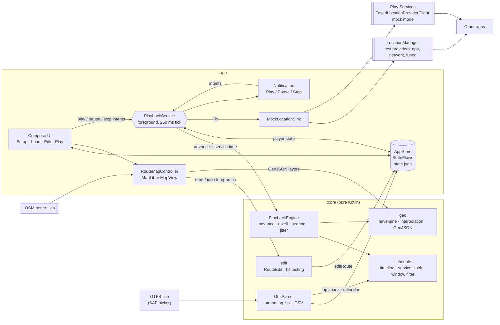

# adb-gps-playback: Android app

Replays GTFS routes as mock GPS **on a real device or emulator, with no adb or
computer needed**. Load a GTFS feed on the phone, stage a trip, hit Play, and
switch to any app. It sees the route as the device's real location, with
bearing and speed filled in and optional GPS jitter. Playback runs in a
foreground service with Play/Pause/Stop in its notification.

> Status: early. Setup, GTFS import, staging, a MapLibre route editor and
> playback with a live map are implemented, but none of it has been run on a
> device yet. See [`docs/android-plan.md`](../docs/android-plan.md) for what's next.

## Build and install

Requirements: Android Studio (or the Android SDK plus JDK 17+).

```bash
cd android
./gradlew :app:installDebug   # or open android/ in Android Studio and Run
./gradlew :core:test          # unit tests, JDK only
```

## One-time device setup

The app's **Setup** tab walks through these steps and shows ✓/✗ for each:

1. Grant the **location** permission. Android requires it for a location
   foreground service, even though the app only writes locations.
2. Grant **notifications** (Android 13+) so the playback controls show up.
3. Enable **Developer options** (Settings → About phone → tap *Build number*
   7×), then *Developer options → Select mock location app → GPS Playback*.
4. Tap **Send test fix**, open a maps app, and check that you're in Cupertino.
   Tap **Clear** when done.

The *Mock Play Services fused location* switch (on by default) also feeds
Google Play Services' fused provider. Most apps, Google Maps included, read
location from there rather than from the platform providers.

## Usage

1. **Load**: open a GTFS `.zip`. By default it lists only trips departing in a
   window (a date plus a start time and length; ◀ ▶ changes the date). Trips
   are included only if their service runs that day, per `calendar.txt` and
   `calendar_dates.txt`, and after-midnight trips from the previous service day
   count too. Expand a route and tap **Stage** on a trip; this also reads its
   timetable. Turn the filter off to list every distinct shape instead.
2. **Edit**: pick a staged route to see it on the map.
   - **Drag** a point to move it
   - **Tap** near the line to insert a point into the nearest segment
   - **Long-press** a point to delete it (a route always keeps at least 2)
   - **Reset** restores the original GTFS geometry
3. **Play**: pick the route and a mode, then tap **Play**.
   - **Follow schedule** (trips staged with a timetable): the vehicle is where
     the timetable says it should be *right now*, in the agency's timezone, and
     it stops at every stop. The **ahead/behind** slider (−10 to +30 min, live)
     shifts it early or late, and the panel shows the next stop and its time.
     **Pause** holds the vehicle in place, so it resumes later than scheduled.
     Dragging the position slider sets the delay implied by the new position.
   - **Fixed speed**: base m/s × multiplier, optionally stopping at each stop.

   In both modes, **Minimum stop time** (default 20 s) sets a floor on dwell
   time. Many feeds list arrival = departure, so without it the vehicle
   wouldn't stop at all. In schedule mode, the vehicle arrives earlier rather
   than departing late, because rider apps compare against departures. There's
   also optional GPS jitter. The map shows the position with a heading arrow
   and follows it while *Keep map centered* is on. Scrub with the position
   slider. **Stop mocking** removes the test providers so the device goes back
   to real GPS.

Maps use MapLibre with OpenStreetMap raster tiles (no API key), sent with an
identifying User-Agent as the OSM tile policy requires.

Apps can detect mocked fixes (`Location.isMock()` on Android 12+). Some apps
refuse them, and working around that is out of scope.

## Architecture



| Path | Responsibility |
| --- | --- |
| `core/.../gtfs/GtfsParser.kt` | Streaming GTFS parse. Synthesizes shapes from stops when missing, with a second zip pass only when needed |
| `core/.../gtfs/Csv.kt` | Minimal streaming RFC 4180 CSV reader |
| `core/.../geo/Geo.kt` | Haversine, cumulative distances, `pointAtDistance`, bearings, meter offsets |
| `core/.../geo/GeoJson.kt` | GeoJSON strings for the map's route, waypoint and position layers |
| `core/.../edit/RouteEdits.kt` | `RouteEdit` (move / insert / delete / reset) and `applyEdit`, mirroring the web store's actions |
| `core/.../edit/HitTest.kt` | Screen-space vertex and segment hit testing for the editor |
| `core/.../playback/PlaybackEngine.kt` | Pure playback step (fixed speed with dwell, or schedule-driven) plus fix generation (bearing, speed, accuracy, Gauss–Markov jitter) |
| `core/.../schedule/ScheduleTimeline.kt` | Trip motion over schedule time: phases, distance / speed at time, minimum-dwell handling |
| `core/.../schedule/StopProjection.kt` | Place stops along the (possibly edited) route, monotonically so loops don't mis-snap |
| `core/.../schedule/ServiceClock.kt` | Wall clock → service-day seconds (handles after-midnight trips); offset that holds a position |
| `core/.../schedule/TripFilter.kt` | Trips departing in a date + time window |
| `core/.../gtfs/ServiceCalendar.kt` | `calendar.txt` + `calendar_dates.txt` |
| `app/.../AppStore.kt` | App state and JSON persistence (routes, player, settings) |
| `app/.../mock/MockLocationSink.kt` | Test-provider lifecycle and `Location` construction |
| `app/.../playback/PlaybackService.kt` | Foreground service, tick loop, notification |
| `app/.../ui/map/RouteMapController.kt` | MapLibre `MapView`: layers, camera fit / auto-pan, edit gestures. Deliberately free of Compose |
| `app/.../ui/map/RouteMap.kt` | Compose wrapper: `AndroidView` plus lifecycle forwarding |
| `app/.../ui/map/MapSetup.kt` | OSM style JSON; MapLibre init with the User-Agent interceptor |
| `app/.../ui/` | Compose screens |
