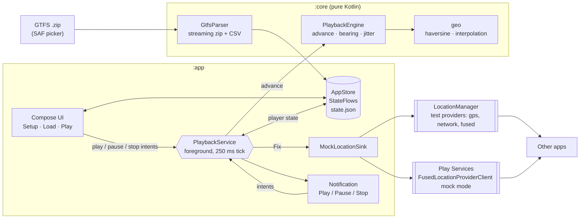

# adb-gps-playback: Android app

Replays GTFS routes as mock GPS **on a real device or emulator, with no adb or
computer needed**. Load a GTFS feed on the phone, stage a trip, hit Play, and
switch to any app. It sees the route as the device's real location, with
bearing and speed filled in and optional GPS jitter. Playback runs in a
foreground service with Play/Pause/Stop in its notification.

> Status: early. Setup, GTFS import, staging and playback (no map yet) are
> implemented. See [`docs/android-plan.md`](../docs/android-plan.md) for what's next.

## Build and install

Requirements: Android Studio (or the Android SDK plus JDK 17+).

```bash
cd android
./gradlew :app:installDebug   # or open android/ in Android Studio and Run
./gradlew :core:test          # unit tests, JDK only
```

## One-time device setup

The app's **Setup** tab walks through these steps and shows ✓/✗ for each:

1. Grant the **location** permission. Android requires it for a location
   foreground service, even though the app only writes locations.
2. Grant **notifications** (Android 13+) so the playback controls show up.
3. Enable **Developer options** (Settings → About phone → tap *Build number*
   7×), then *Developer options → Select mock location app → GPS Playback*.
4. Tap **Send test fix**, open a maps app, and check that you're in Cupertino.
   Tap **Clear** when done.

The *Mock Play Services fused location* switch (on by default) also feeds
Google Play Services' fused provider. Most apps, Google Maps included, read
location from there rather than from the platform providers.

## Usage

1. **Load**: open a GTFS `.zip`, expand a route and tap **Stage** on a shape.
2. **Play**: pick the route, set the speed (m/s × multiplier) and optional
   jitter, then tap **Play**. Scrub with the position slider. **Stop mocking**
   removes the test providers so the device goes back to real GPS.

Apps can detect mocked fixes (`Location.isMock()` on Android 12+). Some apps
refuse them, and working around that is out of scope.

## Architecture



| Path | Responsibility |
| --- | --- |
| `core/.../gtfs/GtfsParser.kt` | Streaming GTFS parse. Synthesizes shapes from stops when missing, with a second zip pass only when needed |
| `core/.../gtfs/Csv.kt` | Minimal streaming RFC 4180 CSV reader |
| `core/.../geo/Geo.kt` | Haversine, cumulative distances, `pointAtDistance`, bearings, meter offsets |
| `core/.../playback/PlaybackEngine.kt` | Pure playback step plus fix generation (bearing, speed, accuracy, Gauss–Markov jitter) |
| `app/.../AppStore.kt` | App state and JSON persistence (routes, player, settings) |
| `app/.../mock/MockLocationSink.kt` | Test-provider lifecycle and `Location` construction |
| `app/.../playback/PlaybackService.kt` | Foreground service, tick loop, notification |
| `app/.../ui/` | Compose screens |
